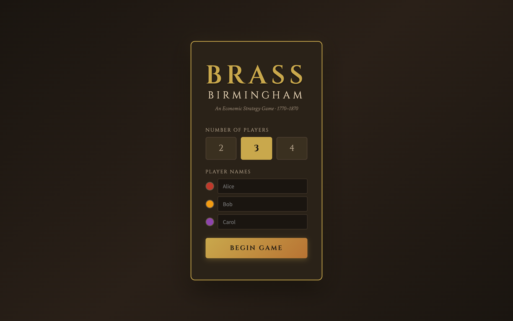
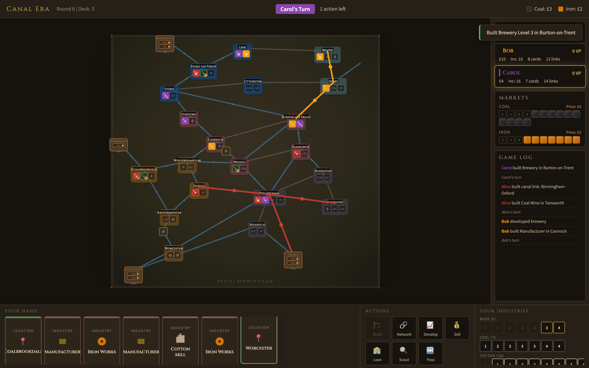
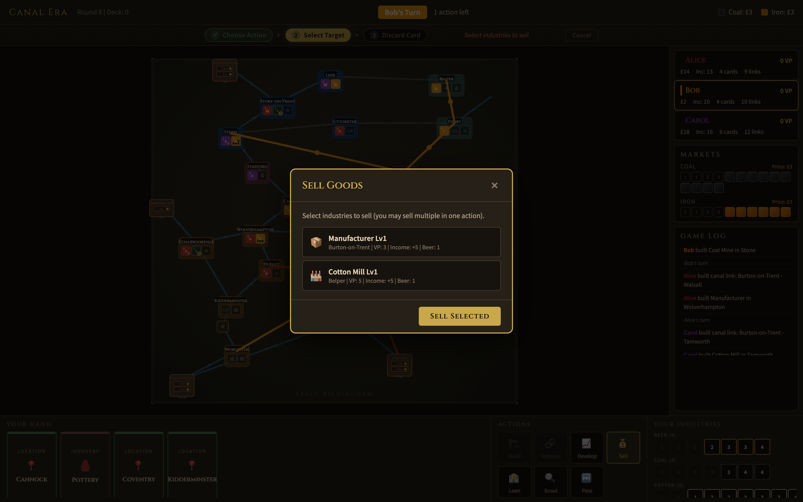
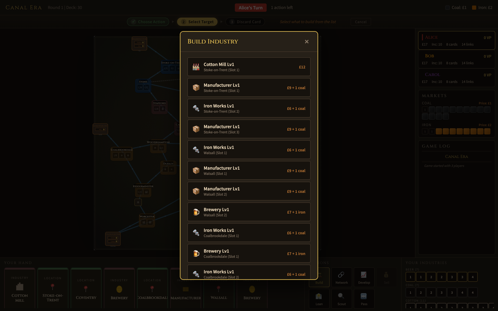
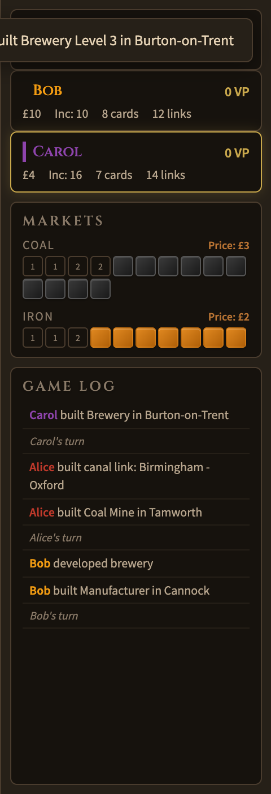
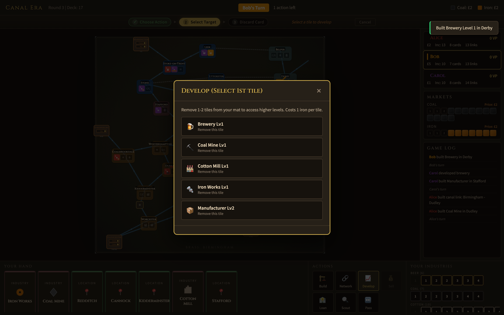
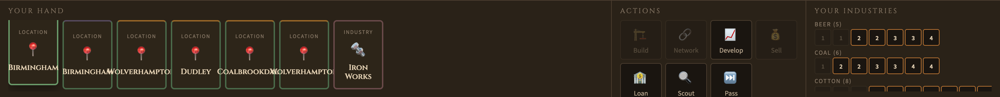
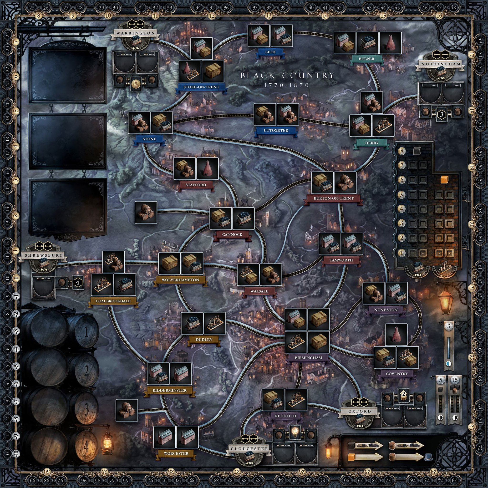
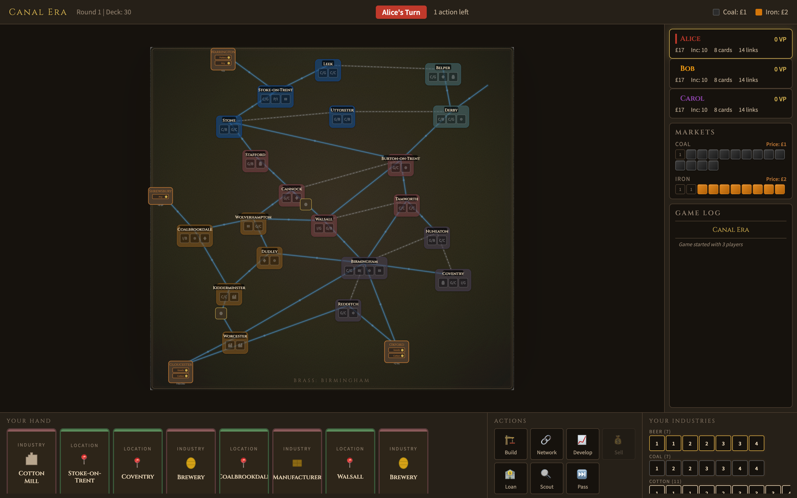

# Brass: Birmingham

[](https://mintlify.com/npow/brass-birmingham)

A digital adaptation of the award-winning board game by Roxley Games. Build your industrial empire across the English Midlands during the height of the Industrial Revolution (1770-1870).

> **Note:** This is an unofficial fan project. [Brass: Birmingham](https://roxley.com/products/brass-birmingham) is designed by Gavan Brown, Matt Tolman, and Martin Wallace, published by Roxley Games. Please support the original by purchasing the physical game.



---

## The Game

Compete as rival entrepreneurs in Birmingham and its surrounding towns. Establish canals and railways, develop industries, and outmaneuver your opponents across two distinct eras.

**2-4 Players** · **Canal Era + Rail Era** · **Hotseat Multiplayer**

### Two Eras of Industry

**Canal Era (1770-1830)** — Build canals and establish your first industries. Only one tile per location. At the end, all canals and Level I tiles are removed — but Level II+ tiles carry over and score again.

**Rail Era (1830-1870)** — Build railways (requiring coal), expand aggressively with multiple tiles per location, and push for the highest score.



<p align="center"><em>Canal Era — the develop action modal over the live board</em></p>



<p align="center"><em>Canal Era — selecting built manufacturers to sell goods</em></p>

---

### Build Your Empire

Choose from six industry types, each with a unique strategic role:

| Industry | Role | Key Trait |
|----------|------|-----------|
| **Cotton Mills** | Sell goods for VP | Expensive but high-scoring |
| **Coal Mines** | Fuel rail links and industries | Cheap, strong income |
| **Iron Works** | Supply iron for building and development | Efficient, denies opponents |
| **Manufacturers** | 8 unique levels with varied rewards | Versatile and complex |
| **Potteries** | Massive VP potential (up to 20 VP) | High cost, requires planning |
| **Breweries** | Supply beer for selling goods | The most important industry |

Select what to build, where, and for how much — all costs including coal and iron sourcing are calculated automatically.



<p align="center"><em>Build action — choose from available industries at locations matching your cards</em></p>

---

### Clear Action Workflow

A persistent **action phase bar** guides you through each turn:

1. **Choose Action** — Pick from Build, Network, Develop, Sell, Loan, Scout, or Pass
2. **Select Target** — Choose what/where to build, which connection, etc.
3. **Discard Card** — Valid cards glow gold; invalid cards are dimmed

The phase bar shows your current step, contextual instructions, and a cancel button. Press **Escape** at any time to abort.

When waiting for card selection, action buttons and your player mat dim to focus attention on your hand. Only valid discard options are clickable.

---

### Game Log & Turn Transitions

A **scrollable game log** in the right panel records every action: builds, network links, sales, loans, and more — color-coded by player. No more relying on fleeting toast notifications.

Between turns, a **brief animated overlay** shows the next player's name in their color, giving a clear visual break.



<p align="center"><em>Right panel — player stats, markets with current prices, and the game log</em></p>

---

### Develop to Unlock Higher Tiers

Spend iron to remove low-level tiles from your player mat and access the powerful high-level industries underneath. Optionally develop two tiles at once.



<p align="center"><em>Develop action — skip past weak tiles to access Level III+ industries</em></p>

---

### Your Hand, Your Strategy

Play location cards to build anywhere on the map, or industry cards to build within your network. Manage your hand carefully — every action costs a card.

Cards show **inline SVG icons** matching each industry type, with colored top borders indicating card type (green for location, red for industry, gold gradient for wild).



<p align="center"><em>Bottom panel — your hand of cards, the seven available actions, and your remaining industry tiles</em></p>

---

### The Board

The game includes the printed board artwork and also has an original, procedural
night-time relief map as a fallback:

- **Procedural terrain** — a hill-shaded elevation raster generated in-page, with an industrial haze over the Black Country basin
- **Region washes** tinting each county, and warm furnace light pooling over every town
- **Towns on slate plinths** with region-coloured name ribbons, as printed on the board
- **Engraved industry art** — a spinning mill, pithead winding gear, blast furnace, sawtooth workshop, bottle kiln and cask, rather than abstract glyphs
- **Canals** as cut waterways and **railways** as ballast with sleeper ties; rivers stay desaturated so they never read as buildable links
- **A numbered 0–99 score track** running the perimeter of a brass frame

Slots permitting two industries show both icons split on the diagonal.

---

### Bundled Board Artwork

The repository includes the board, industry chips, card faces, and player mat
under `assets/`. The board art is shown below; the game overlays the changing
game state on top of it.



To use a different board image, replace `assets/board.jpg` locally or point the
browser at another image:

```js
localStorage.brassBoardAsset = 'https://example.com/board.jpg'
```

The matching chip, card and mat files are already included:

```
assets/board.jpg              the map
assets/tiles/<kind>-<n>.jpg   industry chips, e.g. coal-1.jpg, iron-3-flipped.jpg
assets/cards/<id>.jpg         card faces, keyed by city id or industry id
assets/player-mat.jpg         the player mat
```

The printed map carries the towns, routes and merchant buildings, and the game
draws the changing state on top: placed chips, resource cubes, beer barrels and
highlights. The locally bundled assets are tracked with the project; browser
overrides and calibration remain in local storage.

All 27 locations move to measured positions for a retail board, and each
location's industry spaces are placed using the arrangement the board actually
prints — Coalbrookdale one space over two, Birmingham two over two, and so on,
rather than a single row. To adjust the alignment, open the page with
`?calibrate=1`:

| Input | Effect |
|-------|--------|
| drag a town / merchant / brewery | move it onto its printed space |
| `c` | dump the finished layout as JSON to the console |
| `r` | reset to the measured defaults |

Positions are stored normalised, so one calibration holds for any image at any
resolution, and is saved automatically as you drag.

> Board artwork is normally the publisher's copyright. Supplying an image is
> your call — use art you have the right to use.

### Era Scoring

At the end of each era, score VP from your flipped industry tiles and the links connecting them. Higher-level tiles placed in the Canal Era score in *both* eras.


<p align="center"><em>Canal Era scoring — link VP and industry VP tallied for each player</em></p>

---

## How to Play

### Quick Start

```
python3 -m http.server 8080
```

Open [http://localhost:8080](http://localhost:8080) in your browser. No build step or dependencies.

1. Choose 2-4 players and enter names
2. Click **Begin Game**



### On Your Turn

1. **Select an action** from the action panel (Build, Network, Develop, Sell, Loan, Scout, or Pass)
2. **Follow the phase bar** — it shows your current step and what to do next
3. **Choose your target** from the modal or board
4. **Click a valid card** (highlighted with a gold pulse) to discard

Disabled action buttons show **tooltips explaining why** they can't be used (e.g. "No iron available", "Need at least 3 cards").

The game handles all resource sourcing (coal, iron, beer), market pricing, turn order, and scoring automatically.

### Tips for New Players

- **Build breweries early** — Beer is the most contested resource in the game
- **Watch the turn order** — Spending less money means going first next round
- **Develop to skip weak tiles** — Accessing Level III+ tiles is worth the iron cost
- **Build in the Canal Era for double scoring** — Level II+ tiles persist into the Rail Era
- **Don't ignore income** — It compounds every round and scores VP at the end

---

## Rules Reference

This implementation follows the official Brass: Birmingham rulebook:

- **Coal** requires a connected source (mine or market via merchant link)
- **Iron** can be taken from any iron works on the board — no connection needed
- **Beer** for selling comes from your own breweries (anywhere), connected opponent breweries, or merchant barrels
- **Overbuilding** your own tiles requires same type + higher level; opponent coal/iron tiles can only be overbuilt when that resource is globally depleted
- **Pottery I and III** have the lightbulb icon and cannot be developed — they must be built
- **Turn order** each round goes to whoever spent the least money

---

## Architecture

Pure HTML/CSS/JS — no build tools, no frameworks, no dependencies. Board and
component artwork is bundled under `assets/`; procedural board art remains the
fallback.

| File | Purpose |
|------|---------|
| `index.html` | Layout: setup screen, game screen with phase bar, game log, overlays |
| `css/style.css` | Dark Victorian theme with CSS animations, card-select mode, transitions |
| `js/gameData.js` | All constants: tiles, cities, connections, cards, merchants, markets |
| `js/gameState.js` | Game state, market mechanics, network pathfinding, turn management |
| `js/gameLogic.js` | All 7 actions + `getDisabledReason()` for tooltip feedback |
| `js/industryIcons.js` | Engraved industry illustrations shared by the board and hand cards |
| `js/boardAssets.js` | Bundled board/component artwork + measured board layout |
| `js/boardRenderer.js` | SVG board: procedural terrain, frame + score track, calibration mode |
| `js/uiManager.js` | Phase bar, card selection mode, game log, turn transitions, modals |
| `js/main.js` | Entry point, setup screen |

---

## Credits

- **Brass: Birmingham** designed by Gavan Brown, Matt Tolman, and Martin Wallace
- Published by [Roxley Games](https://roxley.com)
- Tile data verified against the [Tabletop Simulator](https://github.com/ikegami/tts_brass) implementation by Kini/ikegami
- Board geography and card data referenced from community implementations

---

*Fan-made digital adaptation for personal and educational use. All game design credit belongs to the original designers and publisher.*
